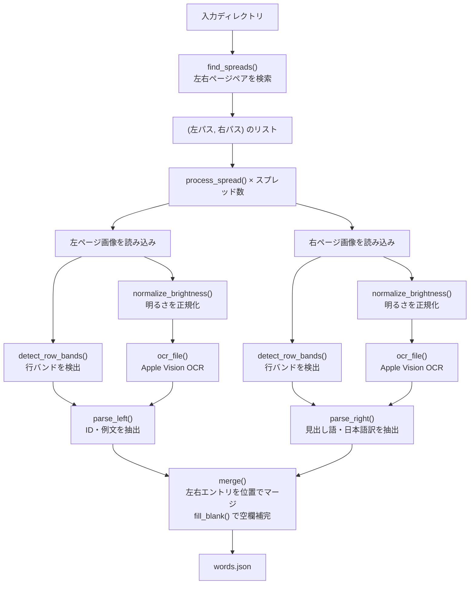

# TOEIC Word Training

「金のフレーズ」の写真を OCR で読み取り、Expo + React Native の単語学習アプリで学べるようにするプロジェクトです。

```
[金のフレーズ写真] → OCRスクリプト → words.json → モバイルアプリ（フラッシュカード学習）
```

## プロジェクト構成

| コンポーネント | 概要 | 状態 |
|---|---|---|
| `scripts/ocr_process.py` | 写真から単語データを抽出する OCR スクリプト | 実装済み |
| Expo / React Native アプリ | フラッシュカード学習・単語一覧画面 | 開発中 |

---

## OCR スクリプト

### 動作環境

- **OS**: macOS（Apple Vision Framework を使用するため必須）
- **Python**: 3.9 以上
- **依存ライブラリ**: `pyobjc-framework-Vision`, `Pillow`, `numpy`

### インストール

```bash
pip install pyobjc-framework-Vision Pillow numpy
```

### 入力画像の準備

**ディレクトリ構成（新形式）**

左ページと右ページをそれぞれ別ディレクトリに入れます。ファイル名順にペアを組むため、ファイル名の並び順を左右で一致させてください。

```
data/
├── 左ページ/
│   ├── 001.jpg
│   └── ...
└── 右ページ/
    ├── 001.jpg
    └── ...
```

**フラット形式（旧形式）**

```
data/
├── left1.jpg
├── right1.jpg
└── ...
```

撮影時は明るく均一な光で撮影し、ページ全体が垂直に収まるようにしてください。

### 実行

```bash
# 基本実行（data/words.json に出力）
python scripts/ocr_process.py --dir ./data/

# 生 OCR データも保存（data/words.raw.json）
python scripts/ocr_process.py --dir ./data/ --raw

# 出力先を指定
python scripts/ocr_process.py --dir ./data/ --out ./data/my_words.json
```

| オプション | デフォルト | 説明 |
|---|---|---|
| `--dir` | `data` | 入力画像のディレクトリ |
| `--out` | `data/words.json` | 出力 JSON のパス |
| `--raw` | なし | 生 OCR データを `*.raw.json` に追加保存 |

### 出力フォーマット（words.json）

```json
[
  {
    "id": 1,
    "english": "anyway",
    "japanese": "とにかく",
    "exampleJa": "とにかくやってみよう。",
    "exampleEn": "Let's try anyway."
  }
]
```

| フィールド | 型 | 説明 |
|---|---|---|
| `id` | number | 通し番号（1始まり） |
| `english` | string | 見出し語 |
| `japanese` | string | 日本語訳 |
| `exampleJa` | string | 例文（日本語） |
| `exampleEn` | string | 例文（英語）。OCR 原文の空欄プレースホルダーを見出し語で補完済み |

---

### モジュール構成

```
scripts/
├── ocr_process.py        # エントリポイント（ocr.cli.main を呼び出すのみ）
└── ocr/
    ├── cli.py            # CLI 引数解析・ページペア検索・メインループ
    ├── vision.py         # Apple Vision Framework を使った OCR
    ├── preprocess.py     # 前処理（明るさ正規化・行バンド検出）
    ├── parse.py          # 左右ページのパース・エントリマージ
    ├── utils.py          # ユーティリティ関数（is_english）
    └── constants.py      # 定数（ENTRIES_PER_PAGE=10, ENTRY_RE）
```

---

### 処理フロー



#### ① ページペアの検索 — `find_spreads()`

`cli.py` の `find_spreads()` が入力ディレクトリを走査し、左右ページの画像ペアを返す。

- **新形式**: `左ページ/` と `右ページ/` サブディレクトリが存在する場合、両者をファイル名昇順でソートして i 番目どうしをペアにする。枚数が一致しない場合はエラー終了。
- **旧形式**: `left1.jpg` + `right1.jpg` のようなファイル名パターンを番号で照合してペアにする。

#### ② スプレッドの処理 — `process_spread()`

`cli.py` の `process_spread()` が 1 組の左右ページを受け取り、前処理・OCR・パースを一括実行する。

#### ③ OCR 前処理 — `preprocess.py`

| 関数 | 処理内容 |
|---|---|
| `normalize_brightness()` | ガウシアンブラーで背景輝度を推定し、照明ムラを補正する。目標輝度 192 に統一。 |
| `detect_row_bands()` | 等間隔に並ぶ枠線の位置を輝度の最暗行として検出し、1 行分のバンド `(y_start, y_end)` を 10 件返す。変動係数（CV）が 15% 以上の場合は信頼性フラグを `False` にして呼び出し元に通知する。 |

右ページで信頼性が低い場合は `detect_row_bands()` の結果を破棄し、後述の `parse_right()` でギャップ分析にフォールバックする。

#### ④ Apple Vision OCR — `ocr_file()`

`vision.py` の `ocr_file()` が Apple Vision Framework を呼び出す。

- 認識言語: `ja-JP`、`en-US`（日英混在対応）
- 精度モード: `VNRequestTextRecognitionLevelAccurate`（最高精度）
- 返り値: `{text, confidence, x, y, w, h}` の辞書リスト。座標は Vision の正規化座標（左下原点）からピクセル座標（左上原点）に変換済み。y 昇順でソートして返す。

#### ⑤ 左ページのパース — `parse_left()`

`parse.py` の `parse_left()` が OCR 結果から例文情報を抽出し、1 ページあたり 10 件固定のリストを返す。

1. x 座標の最大値の 75% を閾値にして右ページへのブリード（OCR の読み取り誤り混入）を除外する。
2. エントリー番号マーカー（1〜3 桁の数字のみの行）を収集し、ページの `base_id` を特定する。
3. 各スロット（10 件）のy範囲を `row_bands` から決定する。`row_bands` が `None` の場合は検出済みマーカーの y 座標から推定する。
4. バンド内のテキストを日本語行（`exampleJa`）と英語行（`exampleEnRaw`）に分類して返す。

#### ⑥ 右ページのパース — `parse_right()`

`parse.py` の `parse_right()` が OCR 結果から見出し語と日本語訳を抽出し、10 件固定のリストを返す。

**`row_bands` あり（枠線検出成功）:**
各バンド内で `is_headword()` を使って見出し語を探す。`is_headword()` の判定基準は「全て小文字、1〜3 単語、高さ 28px 以上、英字・スペース・ハイフンのみ」。Apple Vision が大文字化して誤認識することがあるため、小文字化してから再判定するフォールバックを持つ。

日本語訳は品詞マーカー（`名動形副前接間代助`）で始まる行を優先して採用し、なければ最初の日本語行を使う。

**`row_bands` なし（枠線検出失敗）:**
見出し語の y 座標のギャップ分析によりスロット間の欠損を検出し、`None` を挿入して位置を補正する。

#### ⑦ エントリーのマージ — `merge()` / `fill_blank()`

`parse.py` の `merge()` が左右ページの結果を位置（インデックス）で対応付けてマージする。
`fill_blank()` が英語例文中の空欄プレースホルダー（`a-------` など OCR のばらつきを含む）を見出し語で置換する。

#### ⑧ JSON 出力

全スプレッドのエントリーを結合後、通し番号を振り直して `words.json` に書き出す。`--raw` オプション指定時は OCR 生データ（テキストブロックの座標・信頼度付き）を `words.raw.json` にも保存する。

---

## モバイルアプリ（開発中）

Expo + React Native で実装予定。`words.json` を読み込み、以下の機能を提供します。

- 単語一覧画面
- フラッシュカード学習画面
